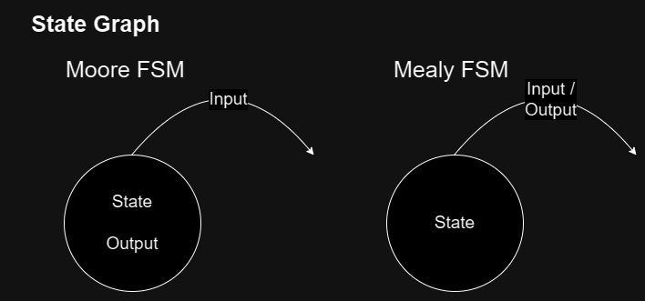

# FSM

| | Moore | Mealy |
|-|-|-|
| Main characteristic| Output depends only on current state | Ouptut depends on current state and inputs |
| Algorithm | 1. Perform output based on current state   2. Wait for prescribed amount of time   3. Get inputs   4. Transition state based on inputs and current state   5. Repeat |  1. Wait for prescribed amount of time   2. Get inputs   3. Perform output based on current state and inputs   4. Transition state based on inputs and current state   5. Repeat |
| Use case | Output necessary to be a state |  Output required only for state transition |

